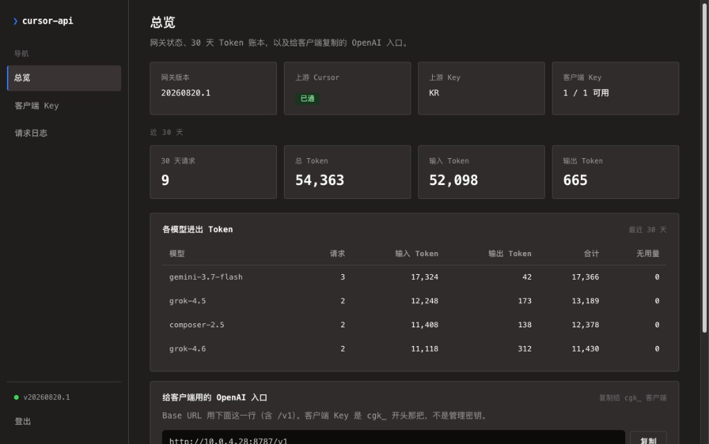

# cursor-api

**把 Cursor 模型暴露成 OpenAI 兼容接口。** 任意 OpenAI 客户端指向 `/v1`；在管理台签发客户端 Key、查看请求日志。



**English:** [`README.md`](./README.md) · **变更记录：** [`CHANGELOG.md`](./CHANGELOG.md)

**你需要：** [Docker Compose](https://docs.docker.com/compose/) 和 [Cursor User API Key](https://cursor.com/settings)。

## 四步部署

**不用 clone 仓库。** 建个目录，把下面的 `docker-compose.yml` 存进去，拉 `ghcr.io/xjoker/cursor-api:latest` 即可。

1. **保存 compose 并启动** — `docker compose up -d`
2. **自动生成配置** — `data/config/gateway.toml`（空模板）
3. **改配置** — 填入三把密钥（见下）
4. **重启** — `docker compose restart` → `http://127.0.0.1:8787`

---

## 1. `docker-compose.yml` + 启动

任意目录下保存为 `docker-compose.yml`：

```yaml
services:
  cursor-api:
    image: ghcr.io/xjoker/cursor-api:latest
    platform: linux/amd64
    user: "${GATEWAY_UID:-1000}:${GATEWAY_GID:-1000}"
    ports:
      - "127.0.0.1:8787:8787"
    volumes:
      - ./data:/app/data
    restart: unless-stopped
    logging:
      driver: json-file
      options:
        max-size: "10m"
        max-file: "3"
```

启动：

```bash
mkdir -p cursor-api && cd cursor-api
# 把上面的 yaml 写入 docker-compose.yml
docker compose up -d
```

第一次可能因密钥未填而退出，正常；`./data/config/gateway.toml` 仍会自动生成。

**仅 Linux — 改完配置后容器读不到文件时：** `gateway.toml` 是 `chmod 600`（只有文件主人能读），容器进程的用户 ID 必须和文件主人一致。在**第一次**启动前执行：

```bash
export GATEWAY_UID=$(id -u) GATEWAY_GID=$(id -g)
docker compose up -d
```

（compose 里的 `GATEWAY_UID` / `GATEWAY_GID` = 容器用哪个 Linux 用户身份跑，默认 `1000`。macOS / Windows 的 Docker 一般不用管。）

**若以前 compose 服务名还是 `gateway`：** 先清掉孤儿容器，否则 8787 端口可能被旧容器占着：

```bash
docker compose down --remove-orphans
docker compose up -d
```

---

## 2. 编辑 `data/config/gateway.toml`

编辑容器生成的 `./data/config/gateway.toml`。

```toml
host = "0.0.0.0"
port = 8787

cursor_api_key = "你的-cursor-user-api-key"
admin_access_key = "随机长串-管理密钥"
api_key_pepper = "随机长串-HMAC-盐"

[logs]
retention_days = 7
max_rows = 100000
detailed = false
```

| 键 | 含义 |
|----|------|
| `cursor_api_key` | Cursor 账号 Key（上游） |
| `admin_access_key` | 管理台登录密钥 |
| `api_key_pepper` | 客户端 Key 哈希用的随机串 |
| `[logs].retention_days` | 请求日志保留天数（1–3650），默认 **7** |
| `[logs].max_rows` | SQLite 请求日志行数上限（1k–10M），先删最旧 |
| `[logs].detailed` | 记录请求/响应 JSON，管理台点击日志可查看（默认 **false**）。正文以**明文**存在 `./data`，请保护数据目录 |
| `[logs].detailed_max_bytes` | 单条请求/响应 JSON 上限（4KiB–1MiB，默认 64KiB） |
| `[logs].max_detail_bytes` | 全部详细正文合计字节上限（默认 256MiB），超限先删最旧行 |

```bash
chmod 600 data/config/gateway.toml
```

---

## 3. 重启

```bash
docker compose restart
curl -s http://127.0.0.1:8787/health
```

应看到 `"status":"ok"`。

---

## 4. 接入客户端

1. 浏览器打开 **http://127.0.0.1:8787/admin/**，填入 `admin_access_key`。
2. **客户端 Key** → 创建 Key（`cgk_` 开头），只显示一次。
3. 客户端配置：

```text
OPENAI_BASE_URL=http://127.0.0.1:8787/v1
OPENAI_API_KEY=<你的 cgk_ 客户端 Key>
```

**快速测试：**

```bash
curl -s http://127.0.0.1:8787/v1/chat/completions \
  -H "Authorization: Bearer cgk_YOUR_KEY" \
  -H "Content-Type: application/json" \
  -d '{"model":"composer-2.5","messages":[{"role":"user","content":"Reply with PONG only."}]}'
```

---

## 客户端接入

**认证：** `Authorization: Bearer cgk_...` 或 `X-Api-Key: cgk_...`

| 方法 | 路径 |
|------|------|
| `POST` | `/v1/chat/completions` |
| `GET` | `/v1/models`、`/v1/models/{id}` |

支持流式（`stream: true`）、视觉（`image_url`）、Cursor 参数（`params`、`variant` 等）。支持 OpenAI 工具调用（`tools` / `tool_calls` / `role: tool`），供 OpenCode 等客户端在本地执行工具。Cursor 的 shell/文件工具保持关闭；仅在有客户端工具时打开 MCP，用来把这些工具暴露给模型。不支持音频。

```python
from openai import OpenAI

client = OpenAI(base_url="http://127.0.0.1:8787/v1", api_key="cgk_YOUR_KEY")
print(client.chat.completions.create(
    model="composer-2.5",
    messages=[{"role": "user", "content": "Hello"}],
).choices[0].message.content)
```

---

## 管理台

浏览器访问 `/admin/`：总览、客户端 Key、请求日志（时间筛选、翻页）。

管理 API：`/admin/api/*`，用同一把 `admin_access_key`（`Authorization: Bearer` 或 `X-Management-Key`）。

---

## 配置说明

唯一配置文件：`data/config/gateway.toml`。可选覆盖见 [`.env.example`](./.env.example)。

**优先级：** 环境变量 → `.env` → TOML → 默认值。

SQLite 与工作区在 `./data`。请求日志按 `[logs]` 在写入时和启动时自动清理。容器 stdout 由 compose 的 `logging.options` 轮转（约 30 MB 上限）。

---

## 本地开发

改代码或跑测试时再 clone 仓库：

```bash
git clone https://github.com/xjoker/cursor-api.git && cd cursor-api
npm ci && npm run dev
```

需 Node **22.13+** 与 `data/config/gateway.toml`。本地编译镜像见 [`docker-compose.yml`](./docker-compose.yml)。

---

## 健康检查

| 端点 | 用途 |
|------|------|
| `GET /health` | 版本与存活 |
| `GET /` | JSON 接口说明（curl）或跳转管理台（浏览器） |

---

## 许可证

MIT — 见 [`package.json`](./package.json)。
